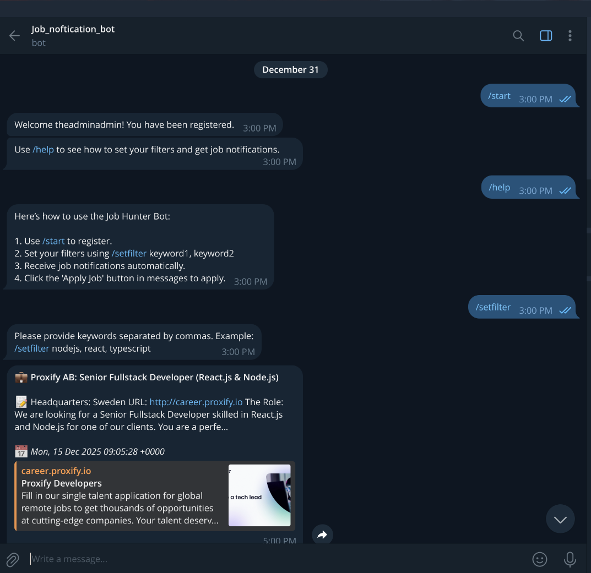
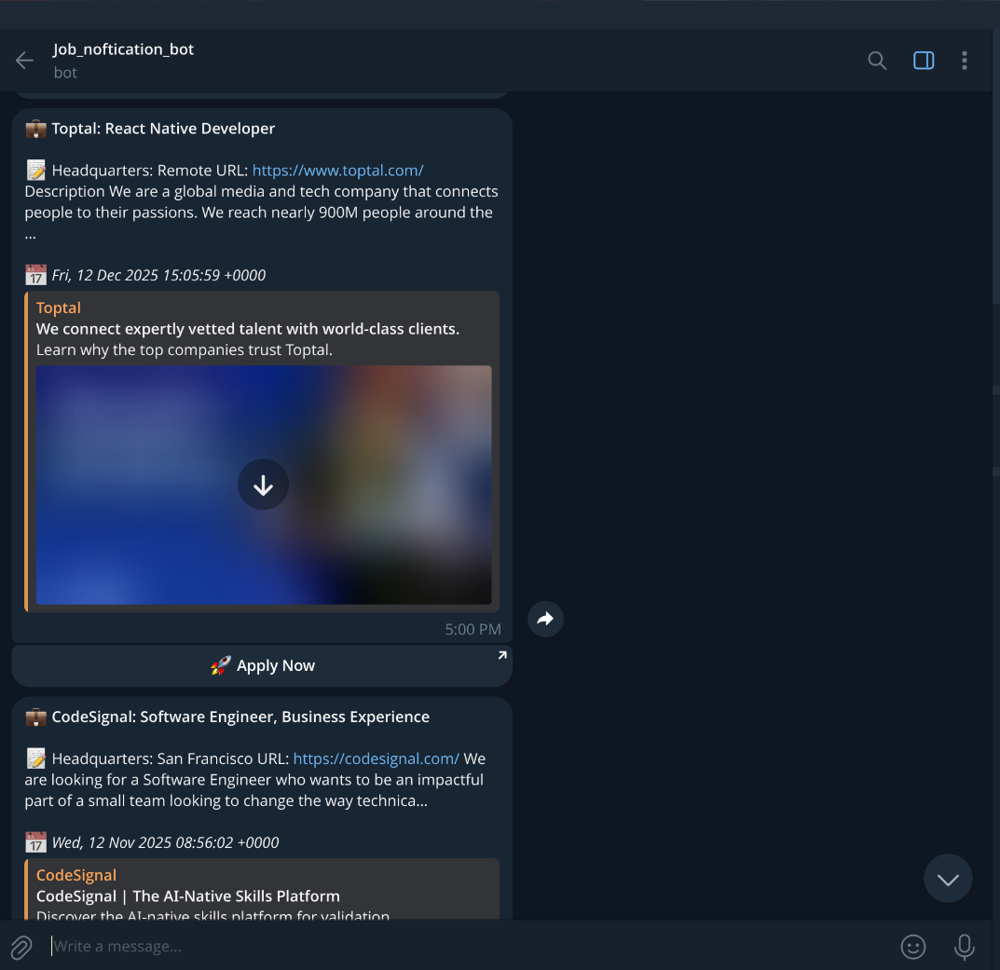

# JobHuntBot 🤖💼

Ever wish someone would **hunt remote tech jobs for you** while you sip coffee or binge your favorite series? Well, meet **JobHuntBot** — my personal little robot that does exactly that. It fetches jobs from multiple RSS feeds, filters them based on my keywords, and sends only the good stuff straight to my Telegram. No more endless scrolling. 

## RSS Feeds

- [We Work Remotely - Programming Jobs](https://weworkremotely.com/categories/remote-programming-jobs.rss)  
- [Remote OK](https://remoteok.com/remote-jobs.rss)  
- [Remotive](https://remotive.com/feed)  
- [WorkAnywhere - Developer Jobs](https://workanywhere.pro/rss/developer.xml)  

## How it works

1. **User Registration**  
   - Users register with the Telegram bot.  
   - Set up a filter with keywords (e.g., `React`, `Node`, `TypeScript`).  

2. **Job Fetching**  
   - The bot fetches jobs from all RSS feeds.  
   - Cleans job content and removes HTML.  

3. **Filtering & Sending**  
   - Filters jobs based on each user's keywords.  
   - Sends matching jobs to the user's Telegram account.  

## Tech Stack

- Node.js + TypeScript  
- MongoDB (to store users, filters, and jobs)  
- RSS Parser + Cheerio (fetch & clean job content)  
- Telegram Bot API  

---

💡 **Note:** This is my personal project, but feel free to fork it and tweak it for your own automated job-hunting adventures. Make it yours, add filters, or just let it find jobs while you chill. ☕🚀
